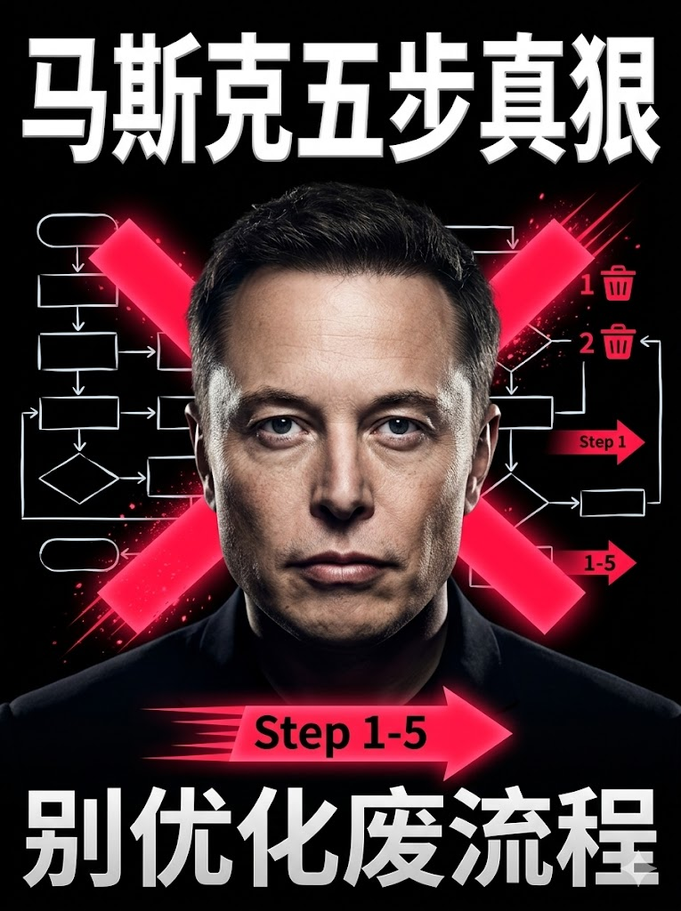

# XHSImage-create

小红书封面创作 Skill 仓库。  
目标是让创作者基于视频脚本，快速产出高点击封面方案，并支持一键调用 OpenAI 或 Gemini 直接生成海报。

## Features

- 3 套封面方案 + 推荐 1 套
- 标题字数硬约束（主副标题各 6-10 汉字）
- 分类化封面策略（对比效果 / 情绪表达 / 插画风格 / 真人形象）
- 案例库沉淀与复用（可持续迭代）
- 直出海报（OpenAI `image2.0` / Gemini `nanobanana`）

## Skill Path

当前核心 Skill 目录：

`skills/xiaohongshu-cover-generator`

## Quick Start

1. 克隆仓库

```powershell
git clone https://github.com/FlowRiver1/XHSImage-create.git
cd XHSImage-create
```

2. 将 Skill 放入你的 Codex Skills 目录（示例）

```powershell
Copy-Item -Recurse -Force ".\\skills\\xiaohongshu-cover-generator" "$env:USERPROFILE\\.codex\\skills\\"
```

3. 配置 API Key（任选其一或都配）

```powershell
$env:OPENAI_API_KEY="your_openai_api_key_here"
$env:GEMINI_API_KEY="your_gemini_api_key_here"
```

可参考模板：

`skills/xiaohongshu-cover-generator/.env.example`

## Direct Image Generation

### OpenAI（Image2.0 路线）

```powershell
python skills/xiaohongshu-cover-generator/scripts/generate_image2_cover.py `
  --provider openai `
  --model image2.0 `
  --prompt-file skills/xiaohongshu-cover-generator/outputs/cover_prompt.txt `
  --output skills/xiaohongshu-cover-generator/outputs/cover_openai.png `
  --size 1024x1536
```

### Gemini（Nano Banana 路线）

```powershell
python skills/xiaohongshu-cover-generator/scripts/generate_image2_cover.py `
  --provider gemini `
  --model nanobanana `
  --prompt-file skills/xiaohongshu-cover-generator/outputs/cover_prompt.txt `
  --output skills/xiaohongshu-cover-generator/outputs/cover_gemini.png `
  --aspect-ratio 3:4
```

## Repository Structure

```text
skills/
  xiaohongshu-cover-generator/
    SKILL.md
    agents/openai.yaml
    scripts/generate_image2_cover.py
    references/
      output-template.md
      cover-playbook.md
      category-prompt-templates.md
      image2-direct-generation.md
    assets/examples/
```

## Showcase

以下是当前仓库内的部分封面效果图，完整样例位于：

`skills/xiaohongshu-cover-generator/assets/examples/AI生成封面效果`

<table>
  <tr>
    <td></td>
    <td></td>
    <td></td>
  </tr>
  <tr>
    <td></td>
    <td></td>
    <td></td>
  </tr>
  <tr>
    <td></td>
    <td></td>
    <td></td>
  </tr>
  <tr>
    <td></td>
    <td></td>
    <td></td>
  </tr>
</table>

## Notes

- API 额度、计费、速率限制由对应平台账户决定。
- 建议定期轮换 API Key，不要在仓库中提交任何真实密钥。
